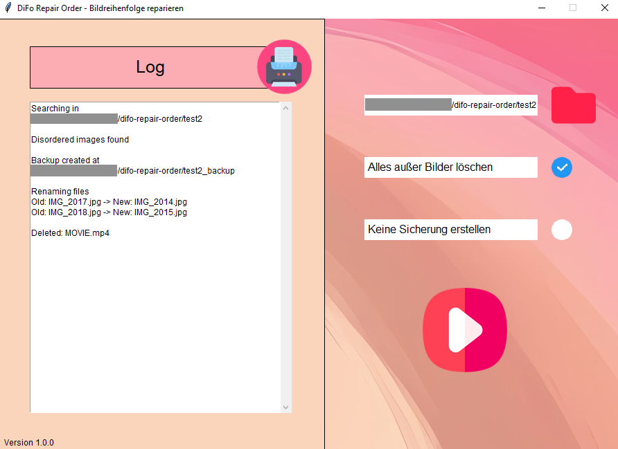

# Beschreibung

Difo liest Bilder manchmal nicht ein, da die Bildreihenfolge nicht stimmt. Dieses Tool benennt die Bilder in eine fortfolgende Reihenfolge um. Das Einlesen ist dann kein Problem mehr. Benutzbar an "Medien-PCs". (Jeder der versteht um was es geht braucht es vermutlich).

# Installation
Download the release and run the self-executable. Alternatively compile it yourself.
### Linux
```
sudo bash build.sh
```
### Windows
On PowerShell you need to turn off the execution policy `set-executionpolicy unrestricted` and afterwards `set-executionpolicy restricted`
```
build.ps1
```

# Screenshot



# Images taken from

<li>
<a href="https://www.flaticon.com/free-icon/paper_10216448?term=printer&page=1&position=15&origin=search&related_id=10216448" title="printer icons">Printer icon created by Vectors Tank - Flaticon</a>
</li>
<li>
<a href="https://www.flaticon.com/free-icon/folder_10263542?term=folder&page=1&position=14&origin=search&related_id=10263542" title="folder icon">Folder icon created by Fathema Khanom - Flaticon</a>
</li>
<li>
<a href="https://www.flaticon.com/free-icon/check_1828640?term=foursquare+check+in&page=1&position=4&origin=tag&related_id=1828640" title="foursquare check in icons">Foursquare check in icon created by Pixel perfect - Flaticon</a>
</li>
<li>
<a href="https://www.flaticon.com/free-icon/play_15194090?term=start&page=1&position=84&origin=search&related_id=15194090" title="ui icons">Ui icon created by Icon Place - Flaticon</a>
</li>
<li>
<a href="https://www.flaticon.com/free-icons/recover-image" title="recover image icons">Recover image icon created by kawalanicon - Flaticon</a>
</li>
<li>
<a href="https://www.freepik.com/pikaso/ai-image-generator" title="freepik ai image generator">Background image created by Freepik AI</a>
</li>